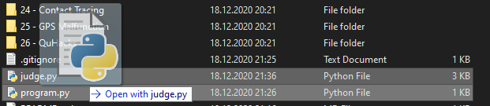

# NoviceJudger2020
**Automated judging tool for QuHacks 2020 Novice Division**

*Important: make sure to manually inspect code before judging for safety purposes.*  
To use, simply run `judge.py`. You will be prompted for a filename, problem number, and language. You can bypass the filename check by adding the filename to the arguments in the command line or by dragging and dropping the file onto `judge.py` in your filesystem.

If the extension of the provided file is in the list of supported extensions, `judge.py` will automatically assume that the language of the file matches. If this is an incorrect assumption, change or remove the file extension and manually input the correct language.
Problem numbers are always supplied manually. They range from 1-26, and leading zeroes are not required.

Once all three parameters are provided, the judging will begin. If any parameter was supplied incorrectly (i.e. missing file, unsupported language, invalid problem number), then you will receive the "Something is wrong" error message. If the terminal closes instantly, then the judge probably threw an error. Open command prompt and run the judge from there with `py judge.py` to diagnose without the window closing immediately.

If judging can begin successfully, the judger will attempt to run the program with the corresponding compiler/interpreter. If the language can be compiled but compilation fails, the resulting verdict will be `C`. Check the `!LOGS/err.err` file for more information. Programs with syntax errors which are written in an interpreted languages will likely instead return the verdict `EEEEEEEEEE`. Make sure to check that is the result of a syntax error, and if so, modify your verdict to `C` before submitting to the competitiors.

If compilation is successful or the language is interpreted, ten test cases will be run, returning one of four verdicts: `A` for Accepted, `W` for Wrong Answer, `E` for Error, and `T` for Timed Out. In all cases, three files will be generated per test case, with a single number ranging from 0-9 for the filename to indicate the test case and the extensions `.txt`, `.out`, and `.err` to indicate the type of file (example: `3.out`). The `.txt` file holds the expected output, the `.out` file holds the program output, and the `.err` file holds the contents of the program's standard error stream. All the files can be found in the `!LOGS` folder. A program times out after spending 10 seconds on a test case, receives the error verdict if its exit code was not 0, and receives a wrong answer verdict in any other case where the outputs do not match. The output is considered correct if the contents of the lines match after stripping any blank lines and leading/trailing whitespace from each line. If the output matches, an accepted verdict is received, regardless of whether the program timed out or threw an error.  
*Important: make sure to verify any negative verdicts to make sure no mistake was made so as not to unfairly penalize teams.*

## Supported Languages
All aliases and extensions are case-insensitive.

### Python 3
Aliases: python, py, python3, py3  
Extension: .py

### Java (source code)
Aliases: java
Extension: .java

### Java (compiled)
Aliases: class  
Extension: .class
